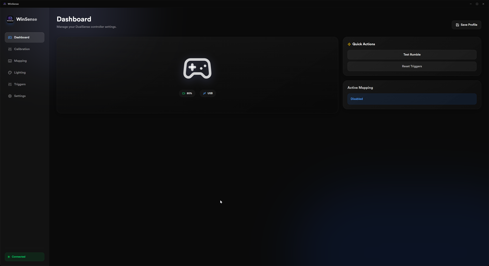
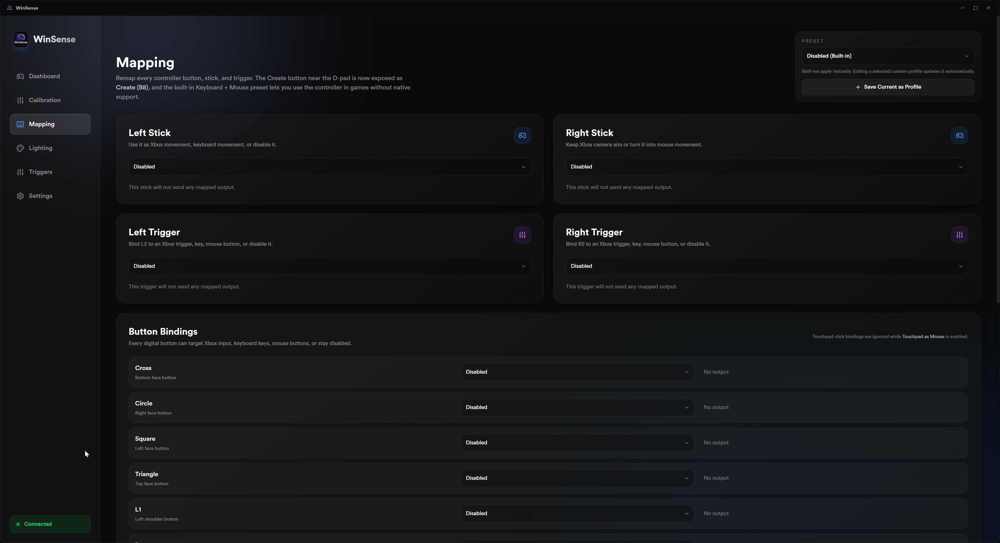
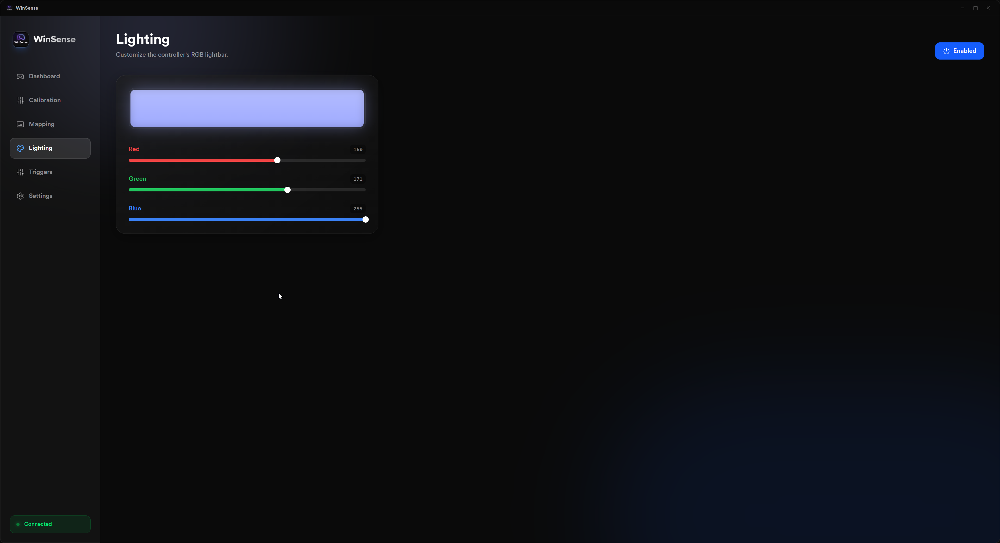
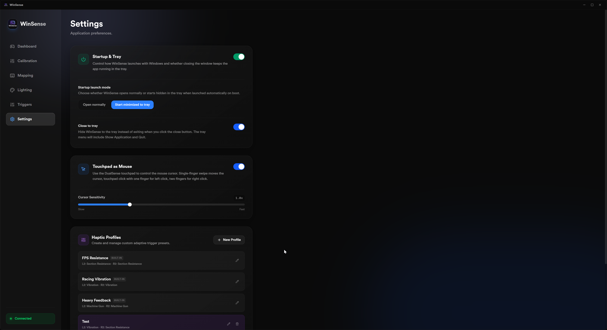

# WinSense

WinSense is a desktop controller utility for DualSense on Windows, built with Tauri, React, and TypeScript.

## Features

- Dashboard for quick controller status and profile actions
- Trigger, lighting, calibration, and mapping controls
- Persistent app settings and profiles
- System tray support with startup options

## Screenshots

### Dashboard



### Mapping



### Lighting



### Settings



## Development

```bash
npm install
npm run tauri dev
```

## Build

```bash
npm run tauri build
```

The Windows installer is generated in `src-tauri/target/release/bundle/nsis/`.
